# ragdolize

### Create realtime physics and save it as keyframes. Using a custom *pure python simple physic engine*, add some dynamics to any chain of transforms. The dynamics are saved as animation curves for the animator to edit it afterwards.


### Main features
|  |  |  |
|--|--|--|
|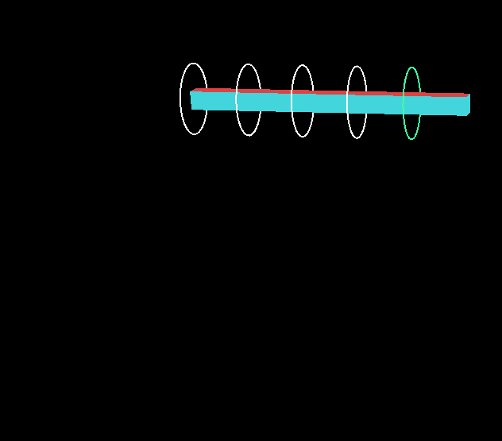|We'll use this animation as a base for all the following examples.   |  |
|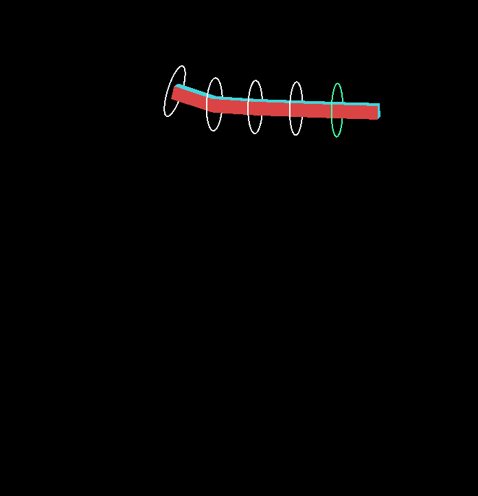|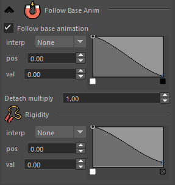|By default this is the result that you can see applying the physics. It will follow the animation according to the control ramps. The lower the ramp value, the more "free" it will be from the base animation and it will follow the physics|
|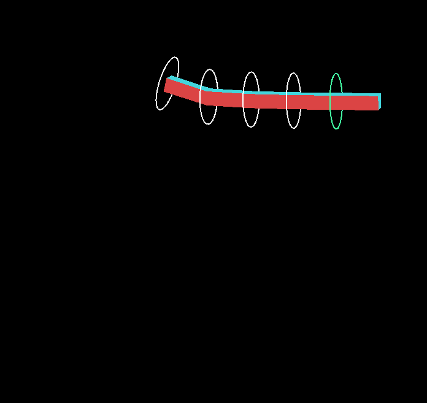||If you start playing with the **follow base animation** and the **rigidity** ramp curves, you can drastically change the result. In the example it tries to  follow less in the middle than the start and the end|
|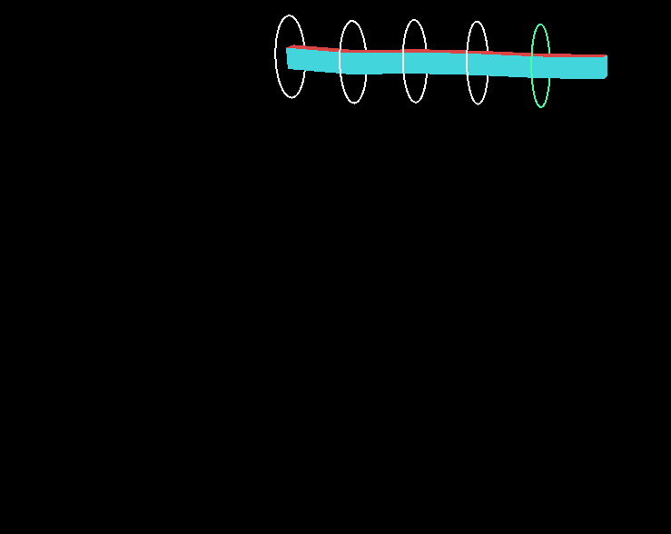|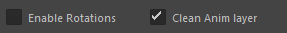|Also you can **disable the control’s rotations**, so they only translate. Now that the rotation isn’t constrained animore, the controls have more freedom to follow the physicss|
|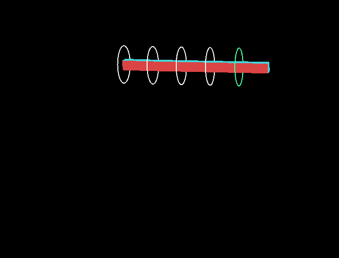||You can change the **gravity** value, so the control doesn't fall|
|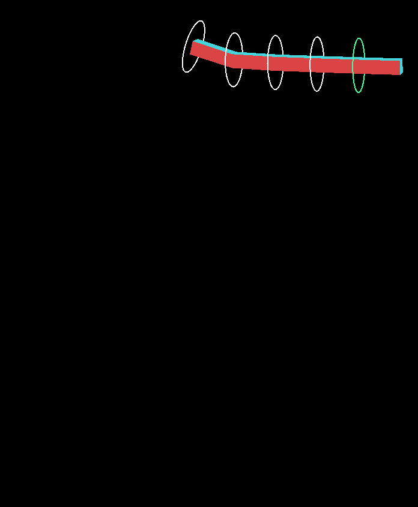|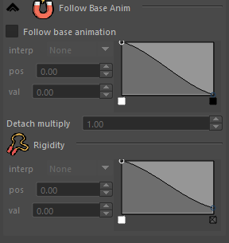|If you want fully physics controls (like a rope or tie), you can **disable the follow animation checkbox**. The root will still follow its parent transformation, but the rest will be free|
|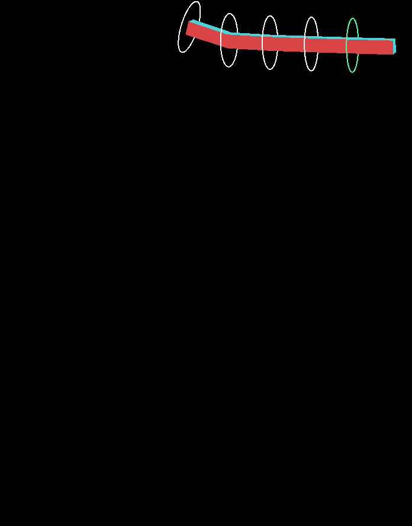|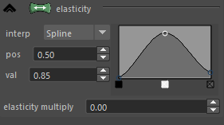|Changing the **elasticity** ramp values handle how much the chain stretch|
|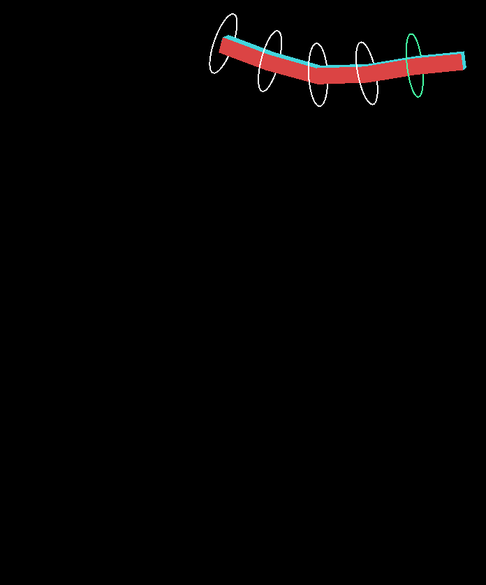|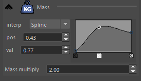|And the **mass** ramp makes some controls heavier than others. Making the center a little more heavy, resulting on a snappier dynamic|
|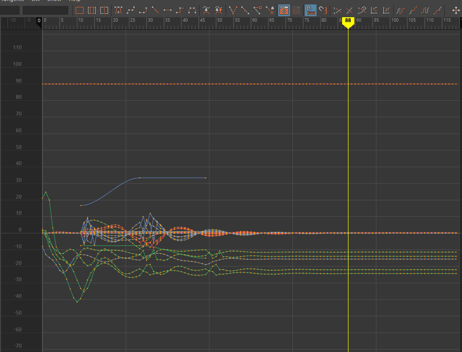|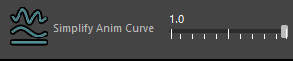|After you are happy with the base dynamic result, you can **simplify the animation** curves with the slider. The curves will try to preserve the main shape but reducing the keyframes making easier to edit|
|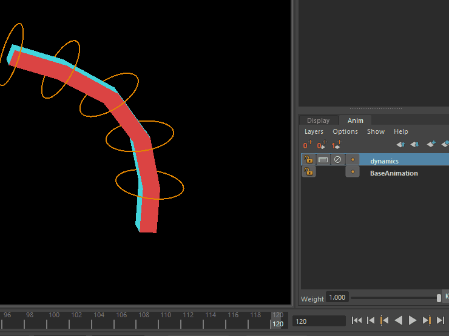||And finally all the dynamics are being saved by default on a new **animation layer**, so you can "multiply" or "reduce" the simulation|


## Running instructions

Clone the project on a path inside Maya's environment, or add the folder path with
```python
import sys
sys.path.append([Your radolize path])
```
Then in maya script editor run the following to open the UI
```python
from ragdolize import ragdolizeWin
ragdolizeWin.show()
```
Then select the controls to add dynamic and


